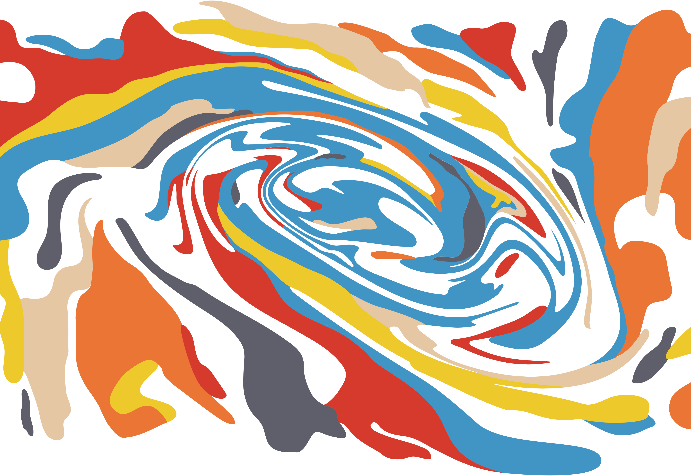
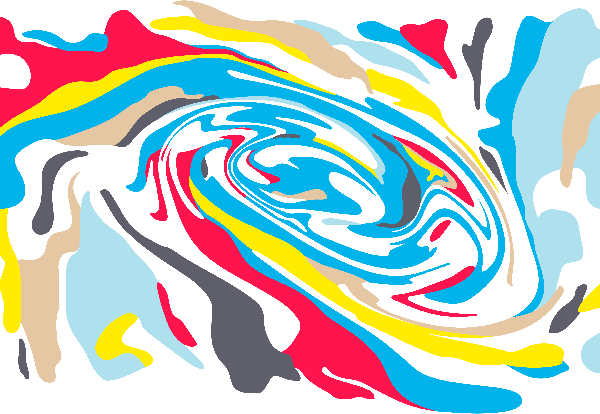

<template v-slot:title>

## Secret Brand

</template>

<twin-columns class="statements">

<template v-slot:left>

### Mission Statement

We build groundbreaking privacy technologies with a focus on increasing usability and adoption. We empower our own community to contribute directly to the success of our network and its applications, and we enable them to directly benefit from its growth. We are passionate and inclusive. We maintain a global presence. We work hard towards driving usage and awareness. We educate and cultivate our community. We build relationships and partnerships across the world so that people everywhere can benefit from privacy.

</template>

<template v-slot:right>

### Vision Statement

By solving for data privacy, Secret Network will become a foundational pillar of a more decentralized, more democratic, and more empowering internet.
Providing privacy and protecting data is critical for empowering people, protecting their freedoms, and unlocking value for users all around the world. We strive to build a sustainable network, ecosystem, and community that will work towards global adoption of our technologies.

</template>

</twin-columns>

<slim-column class="our-brand-is">

<h2>Our visual brand is 

<section class="animated-text">

humanist.

organic.

illustrated.

flowing.

striking.

</section>

</h2>

<a class="white-button" href="/SecretNetwork_BrandBook_Version01.pdf" download>Download our Brandbook</a>

</slim-column>

<slim-column class="logo-section">

## Logo

### Icon

<grid columns="2" class="icon-grid">

<themed-image>

<g-image light light-colored src="../src/assets/logo-seal-outline-black.svg"></g-image>

<g-image dark dark-colored src="../src/assets/logo-seal-outline-white.svg"></g-image>

</themed-image>

The Secret S evokes a flowing network and the duality of secrets: **privacy** and **transparency**.

The ends of the S are open, allowing data to freely flow in and out.
The interior of the S is private, an enclave that encloses the activity of the network itself.

The overall shape of the S is reminiscent of a yin-yang, again reflecting the duality of a privacy-preserving network — a deeply humanist technology.

</grid>

### Primary Logo

<grid columns="2" class="logos-grid">

<a class="download-link" href="/logo-primary-white.svg" download>SVG</a> | <a class="download-link" href="/logo-primary-white.png" download>PNG</a>

<a class="download-link" href="/logo-primary-black.svg" download>SVG</a> | <a class="download-link" href="/logo-primary-black.png" download>PNG</a>

</grid>

### Secondary Logo

<grid columns="2" class="logos-grid">

<a class="download-link" href="/logo-secondary-white.svg" download>SVG</a> | <a class="download-link" href="/logo-secondary-white.png" download>PNG</a>

<a class="download-link" href="/logo-secondary-black.svg" download>SVG</a> | <a class="download-link" href="/logo-secondary-black.png" download>PNG</a>

</grid>

</slim-column>

<slim-column class="opaque-headings">

## Typography

# Heading 1 Montserrat Bold (700)

## Heading 2

### Heading 3

#### Heading 4

Hind Regular (400) is used body copy, and **Hind Bold (700) is used for bold body copy, buttons and alerts.**

</slim-column>

<single-column>

## Paint Swirl

</single-column>

<twin-columns class="paint-swirls">

<template v-slot:left>

### Analog Colors

<a class="download-link" href="/analog.svg" download>SVG</a> | <a class="download-link" href="/analog.png" download>PNG</a>

</template>

<template v-slot:right>

### High Key Colors

<a class="download-link" href="/high-key.svg" download>SVG</a> | <a class="download-link" href="/high-key.png" download>PNG</a>

</template>

</twin-columns>

<single-column class="topographical-map-title">

### Topographical Map

</single-column>

<twin-columns class="paint-swirls">

<template v-slot:left>

<a class="download-link" href="/topographical-white.svg" download>SVG</a> | <a class="download-link" href="/topographical-white.png" download>PNG</a>

</template>

<template v-slot:right>

<a class="download-link" href="/topographical-black.svg" download>SVG</a> | <a class="download-link" href="/topographical-black.png" download>PNG</a>

</template>

</twin-columns>

<single-column class="color-palette">

## Analog Colors

### Primary

<grid columns="6">

<color-palette class="black" hex="#1B1B1B" rgb="rgb(27, 27, 27)"></color-palette>

<color-palette class="white" hex="#FFFFFF" rgb="rgb(255, 255, 255)"></color-palette>

</grid>

### Secondary

<grid columns="6">

<color-palette hex="#5F5F6B" rgb="rgb(95, 95, 107)"></color-palette>

<color-palette hex="#816DA8" rgb="rgb(129, 109, 168)"></color-palette>

<color-palette hex="#D53A2C" rgb="rgb(213, 58, 44)"></color-palette>

<color-palette hex="#EA7534" rgb="rgb(234, 117, 52)"></color-palette>

<color-palette hex="#E5C7A3" rgb="rgb(229, 199, 163)"></color-palette>

<color-palette hex="#FFD72E" rgb="rgb(255, 215, 46)"></color-palette>

<color-palette hex="#5AA361" rgb="rgb(90, 163, 97)"></color-palette>

<color-palette hex="#3EB7AC" rgb="rgb(62, 183, 172)"></color-palette>

<color-palette hex="#4195C4" rgb="rgb(65, 149, 196)"></color-palette>

</grid>

### Tertiary

<grid columns="6">

<color-palette hex="#BCBCCC" rgb="rgb(188, 188, 204)"></color-palette>

<color-palette hex="#D2BEED" rgb="rgb(210, 190, 237)"></color-palette>

<color-palette hex="#EF726C" rgb="rgb(239, 114, 108)"></color-palette>

<color-palette hex="#FFAA88" rgb="rgb(255, 170, 136)"></color-palette>

<color-palette hex="#FFE6D2" rgb="rgb(255, 230, 210)"></color-palette>

<color-palette hex="#FFEB97" rgb="rgb(255, 235, 151)"></color-palette>

<color-palette hex="#B1D8A3" rgb="rgb(177, 216, 163)"></color-palette>

<color-palette hex="#9AE8DA" rgb="rgb(154, 232, 218)"></color-palette>

<color-palette hex="#8FD2EA" rgb="rgb(143, 210, 234)"></color-palette>

</grid>

</single-column>

<single-column class="color-palette">

## High Key Colors

### Primary

<grid columns="6">

<color-palette class="black" hex="#1B1B1B" rgb="rgb(27, 27, 27)"></color-palette>

<color-palette class="white" hex="#FFFFFF" rgb="rgb(255, 255, 255)"></color-palette>

</grid>

### Secondary

<grid columns="6">

<color-palette hex="#5F5F6B" rgb="rgb(95, 95, 107)"></color-palette>

<color-palette hex="#7A5CD6" rgb="rgb(122, 92, 214)"></color-palette>

<color-palette hex="#FF144E" rgb="rgb(255, 20, 78)"></color-palette>

<color-palette hex="#FF6510" rgb="rgb(255, 101, 16)"></color-palette>

<color-palette hex="#FFCE99" rgb="rgb(255, 206, 153)"></color-palette>

<color-palette hex="#FFEC00" rgb="rgb(255, 236, 0)"></color-palette>

<color-palette hex="#25A02B" rgb="rgb(37, 160, 43)"></color-palette>

<color-palette hex="#00DDBE" rgb="rgb(0, 221, 190)"></color-palette>

<color-palette hex="#00B3EA" rgb="rgb(0, 179, 234)"></color-palette>

</grid>

### Tertiary

<grid columns="6">

<color-palette hex="#BCBCCC" rgb="rgb(188, 188, 204)"></color-palette>

<color-palette hex="#D2BEED" rgb="rgb(210, 190, 237)"></color-palette>

<color-palette hex="#EF726C" rgb="rgb(239, 114, 108)"></color-palette>

<color-palette hex="#FFAA88" rgb="rgb(255, 170, 136)"></color-palette>

<color-palette hex="#FFE6D2" rgb="rgb(255, 230, 210)"></color-palette>

<color-palette hex="#FFEB97" rgb="rgb(255, 235, 151)"></color-palette>

<color-palette hex="#B1D8A3" rgb="rgb(177, 216, 163)"></color-palette>

<color-palette hex="#9AE8DA" rgb="rgb(154, 232, 218)"></color-palette>

<color-palette hex="#AEE0ED" rgb="rgb(174, 224, 237)"></color-palette>

</grid>

</single-column>

