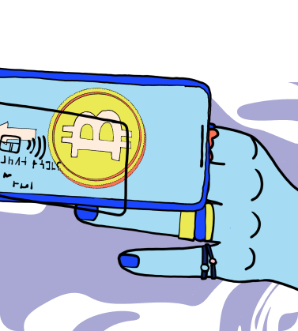
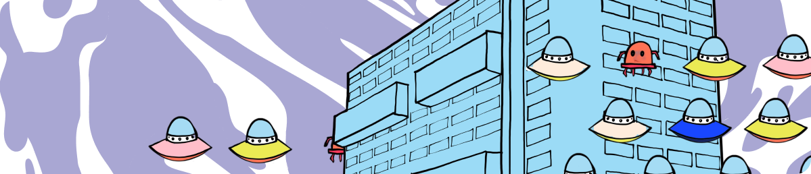

<template v-slot:title>

## Secret Website Documentation

</template>

<slim-column class="description">

This website has a variety of components such as cards, buttons, announcements, etc. Here you can find examples, descriptions and information on how to use them.

<a class="white-button" href="https://github.com/SecretFoundation/SecretWebsite">Go to Github Repository</a>

</slim-column>

<slim-column>

## Cards

### Home Cards

Home Cards are the main Call to Action on the Homepage. They are used as links to other pages on the website.

<themed-image>

<g-image light light-colored src="../src/assets/vertical_card_light.png" class="width__455px"></g-image>

<g-image dark dark-colored src="../src/assets/vertical_card_dark.png" class="width__455px"></g-image>

</themed-image>

<themed-image>

<g-image light light-colored src="../src/assets/horizontal_card_light.png"></g-image>

<g-image dark dark-colored src="../src/assets/horizontal_card_dark.png"></g-image>

</themed-image>

#### Example

<pre>
<code><
home-card
 
to
="/about/about-secret-network" 
vertical
>
### **Learn about**<
br
>Secret Network
<
separator small
 />

   

</
home-card
></code>
</pre>

<pre>
<code><
home-card
 
to
="/about/about-secret-network" 
horizontal
>
### **Explore the**<
br
>Ecosystem
<
separator small
 />

   

</
home-card
></code>
</pre>

### Media Cards

Media Cards are used to share media content such as videos, podcast episodes and blog articles, whether it's Secret Network original content or from an external source but relates to Secret Network.

<themed-image>

<g-image light light-colored src="../src/assets/media_card_light.png" class="width__490px"></g-image>

<g-image dark dark-colored src="../src/assets/media_card_dark.png" class="width__490px"></g-image>

</themed-image>

#### Example

<pre>
<code><
media-card
&nbsp;
tag
="podcast" 
title
="Tor Bair on Nugget's News Podcast" 
src
="media-card/image2.png" 
to
="https://www.youtube.com/watch?v=2kttQDQOT3Y" 
cta
="Listen Now"></
media-card
></code>
</pre>

### Cards

Cards are very versatile components, composed by a header, body and footer, and can be used to describe concepts, steps or just link to other pages.

<themed-image>

<g-image light light-colored src="../src/assets/cards_light.png" class="width__570px"></g-image>

<g-image dark dark-colored src="../src/assets/cards_dark.png" class="width__570px"></g-image>

</themed-image>

#### Example

<pre>
<code><
card
>

<
template
 
v-slot
:header>

    

</
template
>

#### Node Runner Guide

<
template
 
v-slot
:footer>

<
next-button
 
tag
="Read guide"

to
="https://build.scrt.network/validators-and-full-nodes/join-validator-mainnet.html">

</
next-button
>

</
template
>

</
card
>

</code>
</pre>

### Community Cards

Community cards are used to link Secret Network social media and platforms where the community gets together. (e. g. Telegram, Discord, etc.)

<themed-image>

<g-image light light-colored src="../src/assets/community_card_light.png" class="width__455px"></g-image>

<g-image dark dark-colored src="../src/assets/community_card_dark.png" class="width__455px"></g-image>

</themed-image>

#### Example

<pre>
<code>

<
community-grid
 
name
="Discord Chat" 
to
="https://discord.com/invite/SJK32GY" 
class
="discord">

<
template
 
v-slot
:icon>

<
themed-image
>

<
g-image
 
light light-colored

src
="./img/community-card/discord-black.svg"></
g-image
>

<
g-image
 
light light-colored

src
="./img/community-card/discord-white.svg"></
g-image
>

</
themed-image
>

</
template
>

</
community-grid
>

</code>
</pre>

### Grid Item

As its name suggests, this component is part of a grid of elements such as validators, contributors, members, etc. They are used as links and when hovering over them, the name and tags are displayed.

<themed-image>

<g-image light light-colored src="../src/assets/grid_item_light.png" class="width__530px"></g-image>

<g-image dark dark-colored src="../src/assets/grid_item_dark.png" class="width__530px"></g-image>

</themed-image>

#### Example

<pre>
<code>

<
grid-item
 
name
="Secret Nodes" 
tag
="validator" 
tagTwo
="developer" 
to
="https://secretnodes.org" 
src
="grid-item/contributors/image2.png">

</
grid-item
>

</code>
</pre>

</slim-column>

<slim-column>

## Buttons

### "Next" Button

Composed by a "next" arrow and a tag, used mostly to link to other pages inside or outside the website.

<themed-image>

<g-image light light-colored src="../src/assets/next_button_light.png" class="width__250px"></g-image>

<g-image dark dark-colored src="../src/assets/next_button_dark.png" class="width__250px"></g-image>

</themed-image>

#### Example

<pre>
<code><
next-button
 
tag
="See more" 
to
="/podcast">

</
next-button
>
</code>
</pre>

### "Back" Button

Composed by a "back" arrow and a tag, used mostly to link to the previous page.

<themed-image>

<g-image light light-colored src="../src/assets/back_button_light.png" class="width__250px"></g-image>

<g-image dark dark-colored src="../src/assets/back_button_dark.png" class="width__250px"></g-image>

</themed-image>

#### Example

<pre>
<code><
back-button
 
tag
="Back to Ecosystem" 
to
="/ecosystem/overview">

</
back-button
>
</code>
</pre>

</slim-column>

<slim-column>

## Announcements

### Large Announcement

This announcement occupies 100% of the page width and it's part of the website's layout so it's visible on every page. It's composed by the announcement text and link on the left and an image on the right.

<themed-image>

<g-image light light-colored src="../src/assets/large_announcement_light.png"></g-image>

<g-image dark dark-colored src="../src/assets/large_announcement_dark.png"></g-image>

</themed-image>

#### Example

<pre>
<code><
announcement
>

<
template
 
v-slot
:content-left>

#### Announcement

### Upgrade Complete:<
br
>Secret Contracts are<
br
>LIVE on Mainnet!

The secret is out! Privacy-preserving smart contracts are now LIVE on Secret Network. Learn about this launch, our exciting initial apps, our new strategic partnership with Hashed, and what comes next as "programmable privacy" comes to public blockchains.

</
template
>

<
template
 
v-slot
:content-right>

</
template
>

</
announcement
>
</code>
</pre>

### Small Announcement

This announcement occupies 2/3 of the page width and it's part of the website's layout so it's visible on every page. It's composed by the announcement text and link.

<themed-image>

<g-image light light-colored src="../src/assets/small_announcement_light.png" class="width__620px"></g-image>

<g-image dark dark-colored src="../src/assets/small_announcement_dark.png" class="width__620px"></g-image>

</themed-image>

#### Example

<pre>
<code><
small-announcement
>

<
template
 
v-slot
:content>

#### Announcement

### Secret Network Gets a Secret API!

Chain of Secrets just launched the Secret API for Secret Network as part of our developer community on-boarding efforts. We hope to connect and collaborate with all kinds of secret app builders!

<
next-button
 
class
="turquoise" 
tag
="Read more"
 

to
="/blog/secret-api/">

</
next-button
>

</
template
>

</
small-announcement
>
</code>
</pre>

</slim-column>

