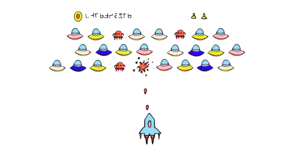

<template v-slot:title>

## Secret Network Ecosystem

</template>

<slim-column>

### Contributors

Secret Network is currently supported by over 30 active validators as well as a number of key contributors to the ecosystem developing network tooling, core protocol functionality, and more. 

A few key network contributors are featured below.

<grid columns="4" class="contributors-grid">

<grid-item tag="" tagTwo="" name="Secret Foundation" to="https://learn.scrt.network/foundation.html" src="grid-item/contributors/image1.png">

</grid-item>

<grid-item tag="validator" tagTwo="developer" name="Secret Nodes" to="https://secretnodes.org/#/" src="grid-item/contributors/image2.png">

</grid-item>

<grid-item tag="developer" tagTwo="" name="Enigma"  to="https://www.enigma.co/" src="grid-item/contributors/image3.png" >

</grid-item>

<grid-item tag="validator" tagTwo="developer" name="Chain of Secrets" to="https://chainofsecrets.org/" src="grid-item/contributors/image4.png">

</grid-item>

<grid-item tag="wallet" tagTwo="validator" name="Mathwallet" to="http://mathwallet.org/" src="grid-item/contributors/image5.png">

</grid-item>

<grid-item tag="fund" tagTwo="validator" name="Outlier" to="https://outlierventures.io" src="grid-item/contributors/image6.png">

</grid-item>

<grid-item tag="validator" tagTwo="" name="Dokia Capital" to="https://dokia.capital/" src="grid-item/contributors/image7.png">

</grid-item>

<grid-item tag="validator" tagTwo="" name="Citadel.one" to="https://citadel.one" src="grid-item/contributors/image8.png">

</grid-item>

<grid-item tag="fund" tagTwo="" name="Fenbushi" to="https://fenbushi.vc" src="grid-item/contributors/image9.png">

</grid-item>

<grid-item tag="fund" tagTwo="" name="Hashed" to="https://hashed.com" src="grid-item/contributors/image10.png">

</grid-item>

<grid-item tag="validator" tagTwo="" name="B-Harvest" to="https://bharvest.io" src="grid-item/contributors/image11.png">

</grid-item>

<grid-item tag="validator" tagTwo="" name="Chorus One" to="https://chorus.one" src="grid-item/contributors/image12.png">

</grid-item>

</grid>

</slim-column>

<slim-column class="see-more">

<next-button tag="See more" to="/contributors">

</next-button>

</slim-column>

<announcement>

<template v-slot:content-left>

#### Announcement

### Secret Network Ecosystem Update: November 2020

As we approach the December launch of our first Secret Bridge, bringing programmable privacy to Ethereum and ERC-20s, here's a look back at an eventful November for Secret Network!

<next-button class="turquoise" tag="Read more" to="/blog/secret-network-ecosystem-update-november-2020">

</next-button>

</template>

<template v-slot:content-right>

</template>

</announcement>

<slim-column>

### Exchange and Wallet Support

Secret Network is secured by the SCRT coin (Secret), which is used for fees, staking, and governance. You can trade Secret (SCRT) on Binance. See also: CoinMarketCap and CoinGecko. Multiple wallets already provide support for SCRT transactions and staking:

</slim-column>

<card-holder columns="3">

<card>

<template v-slot:header>

#### Ledger Nano S and Ledger Nano X

</template>

<template v-slot:footer>

[See documentation](https://build.scrt.network/ledger-nano-s.html)

</template>

</card>

<card>

<template v-slot:header>

#### Keplr &nbsp;

</template>

<template v-slot:footer>

[Visit website](https://wallet.keplr.app)

</template>

</card>

<card>

<template v-slot:header>

#### Cosmostation Wallet

</template>

<template v-slot:footer>

[Visit website](https://wallet.cosmostation.io/)

</template>

</card>

</card-holder>

<card-holder columns="2">

<card>

<template v-slot:header>

#### Citadel.One

</template>

<template v-slot:footer>

[Visit website](https://citadel.one/)

</template>

</card>

<card>

<template v-slot:header>

#### Math Wallet

</template>

<template v-slot:footer>

[Visit website](https://mathwallet.org/web/secret)

</template>

</card>

</card-holder>

<slim-column>

### Block Explorers and Staking

Use the following Secret Network block explorers for staking, governance proposals, viewing transactions and active validators, and much more:

</slim-column>

<card-holder columns="2">

<card>

<template v-slot:header>

#### Puzzle by Secretnodes.org

</template>

<template v-slot:footer>

[Visit website](https://puzzle.report)

</template>

</card>

<card>

<template v-slot:header>

#### Cashmaney Secret Network Explorer

</template>

<template v-slot:footer>

[Visit website](https://explorer.cashmaney.com/)

</template>

</card>

</card-holder>

<slim-column>

You can find information on staking rewards calculations at:

</slim-column>

<card-holder columns="2">

<card>

<template v-slot:header>

#### Stake or Die!

</template>

<template v-slot:footer>

[Visit website](https://stakeordie.com/rewards-calculator)

</template>

</card>

<card>

<template v-slot:header>

#### Staking Rewards

</template>

<template v-slot:footer>

[Visit website](https://www.stakingrewards.com/earn/secret-network)

</template>

</card>

</card-holder>

