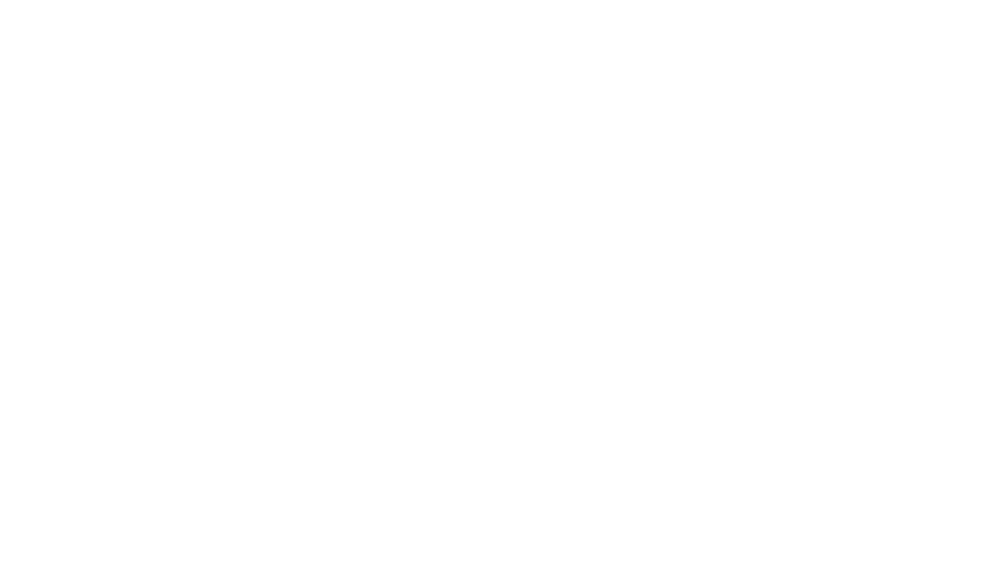

<simple-hero>

<template v-slot:cover>

</template>

## Welcome to Secret Network

</simple-hero>

<slim-column>

### About
## What’s the secret of Secret Network?

Secret Network is a blockchain-based, open-source protocol that lets anyone perform computations on encrypted data, bringing privacy to smart contracts and public blockchains. Our mission: improve the adoption and usability of decentralized technologies, for the benefit of all.

These are some ways you can join the Secret Network:

</slim-column>

<triplet-columns>

<template v-slot:left>

### Community

Read more about our blockchain-based, open-source protocol that lets anyone perform computations on encrypted data.

</template>

<template v-slot:middle>

### Developers

Read our documentation and learn how you can write Secret Contracts and start building.

</template>
  
<template v-slot:right>

### Operators

Lorem ipsum dolor sit amet, consectetur adipiscing elit. Odio viverra integer id nec mauris dui. Pellentesque turpis morbi vulputate.

</template>

</triplet-columns>

</text-banner>

