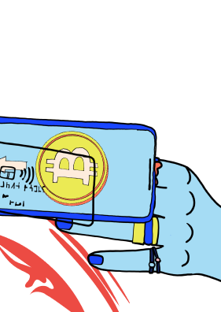

<ClientOnly>
<home-page-hero></home-page-hero>
</ClientOnly>

<slim-column>

### About
## What’s the secret of Secret Network?

Secret Network is a blockchain-based, open-source protocol that lets anyone perform computations on encrypted data, bringing privacy to smart contracts and public blockchains. Our mission: improve the adoption and usability of decentralized technologies, for the benefit of all.

These are some ways you can join the Secret Network:

</slim-column>

<triplet-columns>

<template v-slot:left>

### **Join the** Community

</template>

<template v-slot:middle>

### **Build a**  Secret App

</template>
  
<template v-slot:right>

### **Become a** Node Operator

</template>

</triplet-columns>

</text-banner>

